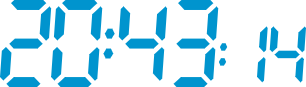
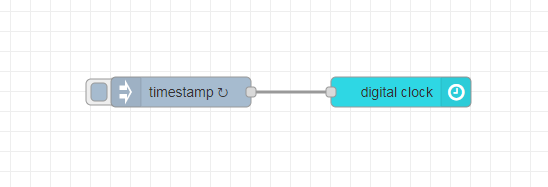

# node-red-contrib-ui-digital-clock

A digital clock for the Node-RED Dashboard.



## Installation

Open Node-RED and select `Manage palette` from the menu to open the Palette Manager. Go to the `Install` tab, search for `node-red-contrib-ui-digital-clock` and click `install`.

Alternatively, you can run the following command in your Node-RED user directory (typically `~/.node-red`):

```
npm i node-red-contrib-ui-digital-clock
```

## Example



```
[{"id":"c09db1ba6ac377de","type":"tab","label":"Flow 1","disabled":false,"info":"","env":[]},{"id":"37ec70937bed02a4","type":"ui_digital_clock","z":"c09db1ba6ac377de","name":"","group":"5c79b643fcd37cad","order":0,"width":"6","height":"2","x":710,"y":340,"wires":[]},{"id":"105daf8d29a83f81","type":"inject","z":"c09db1ba6ac377de","name":"","props":[{"p":"payload"},{"p":"topic","vt":"str"}],"repeat":"1","crontab":"","once":true,"onceDelay":0.1,"topic":"","payload":"","payloadType":"date","x":490,"y":340,"wires":[["37ec70937bed02a4"]]},{"id":"5c79b643fcd37cad","type":"ui_group","name":"Standard","tab":"f4a9e911ba044f38","order":1,"disp":true,"width":"6","collapse":false,"className":""},{"id":"f4a9e911ba044f38","type":"ui_tab","name":"Home","icon":"dashboard","disabled":false,"hidden":false}]
```

## License

[MIT](LICENSE)

## Projects

Also take a look at my other dashboard projects:

### [node-red-contrib-ui-clock](https://github.com/patrickknabe/node-red-contrib-ui-clock)

A simple analog clock for the Node-RED Dashboard.


### [node-red-contrib-ui-digital-display](https://github.com/patrickknabe/node-red-contrib-ui-digital-display)

A digital display, with adjustable number of digits and decimals, for the Node-RED Dashboard.

